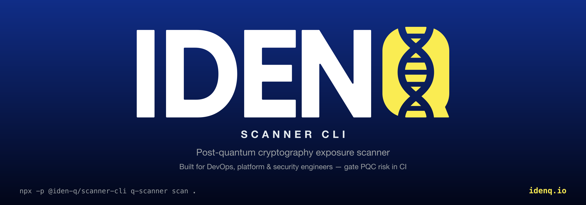
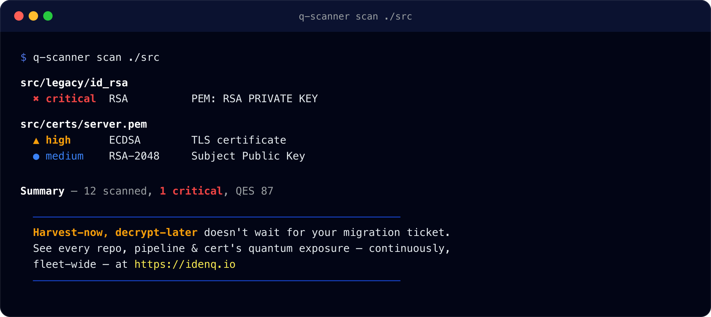

<p align="center">
  
</p>

# @iden-q/scanner-cli

Command-line post-quantum cryptography exposure scanner, for DevOps, platform, and security engineers who need to know what crypto is quietly shipping to prod. Point it at a file, a folder, piped stdin (e.g. a `git diff`), or a live domain's TLS certificate, and it reports crypto that's vulnerable to quantum attack. Built for CI pipelines (via `--fail-on`) as well as local dev use.

## Install

Global install:

```bash
npm install -g @iden-q/scanner-cli
q-scanner scan .
```

No-install, via npx (the package's bin is `q-scanner`, not the package name):

```bash
npx -p @iden-q/scanner-cli q-scanner scan .
```

## Usage

```
q-scanner — post-quantum cryptography exposure scanner

Usage:
  q-scanner scan <path>          Scan a file or folder for vulnerable crypto
  q-scanner scan --stdin         Scan piped text (e.g. git diff | q-scanner scan --stdin)
  q-scanner scan-domain <host>   Scan a domain's TLS certificate

Options:
  --format <table|json|cbom>     Output format (default: table); cbom emits a CycloneDX Cryptography Bill of Materials
  --lang <en|es>                  Output language (default: en)
  --output <path>                 Where to write the report file (default: ./q-scanner-report.<ext>, written every run)
  --fail-on <critical|high|medium|low>
                                  Exit 1 if the worst finding meets/exceeds this severity
  --connect-mesh                  Emit anonymous CBOM telemetry to the iden-q mesh (scan and scan-domain;
                                  standalone by default). Never affects the scan result or exit code.
  --mesh-key <clientId:apiKey>    Mesh API key inline; or set IDENQ_MESH_CLIENT_ID + IDENQ_MESH_API_KEY (preferred in CI)
  --mesh-url <url>                Mesh base URL; or IDENQ_MESH_URL. Required to emit — there is no default target.
  -h, --help                     Show this help
```

Output defaults to English; pass `--lang es` for Spanish (finding locations, error messages, and regulatory notes). Colored, animated output is used automatically on an interactive terminal (respects `NO_COLOR`); it's plain text — and quiet, no spinner frames — when piped or run in CI.

Every run also writes the report to disk (in the requested `--format`) so it can be picked up by report tooling without remembering to redirect stdout — to `./q-scanner-report.<txt|json|cbom.json>` by default, or wherever `--output <path>` points.

<p align="center">
  
</p>

### Examples

Scan a folder and print a table:

```bash
q-scanner scan ./src
```

Scan a domain's TLS certificate as JSON:

```bash
q-scanner scan-domain example.com --format json
```

Gate a CI step on findings — fail the build if a diff introduces anything high severity or worse:

```bash
git diff origin/main...HEAD | q-scanner scan --stdin --fail-on high
```

Scan in Spanish:

```bash
q-scanner scan ./src --lang es
```

Emit a Cryptography Bill of Materials (CycloneDX, tagging PQC algorithms with their NIST FIPS standard — ML-KEM/FIPS 203, ML-DSA/FIPS 204, SLH-DSA/FIPS 205) to a specific path — omit `--output` and it still lands at `./q-scanner-report.cbom.json`:

```bash
q-scanner scan ./src --format cbom --output cbom.json
```

Connect a CI scan to the iden-q mesh (credentials from the pipeline's secret store, never in argv):

```bash
IDENQ_MESH_CLIENT_ID=$MESH_CLIENT_ID \
IDENQ_MESH_API_KEY=$MESH_API_KEY \
IDENQ_MESH_URL=https://idenq.io \
  q-scanner scan ./src --connect-mesh
```

A `scan-domain` contributes too — the negotiated key-exchange group's class (classical / hybrid / post-quantum) and the certificate's issuer, named from its organisation:

```bash
IDENQ_MESH_CLIENT_ID=$MESH_CLIENT_ID \
IDENQ_MESH_API_KEY=$MESH_API_KEY \
IDENQ_MESH_URL=https://idenq.io \
  q-scanner scan-domain example.com --connect-mesh
```

## Connecting to the mesh (`--connect-mesh`)

The scanner is **standalone by default** — it makes no network call and works fully offline. `--connect-mesh` opts a `scan` or a `scan-domain` in to emitting **anonymous CBOM telemetry** — the shared node/edge graph, with each key establishment classed classical, hybrid, or post-quantum — to the iden-q mesh. Nothing that identifies the machine, the host, or the code is sent — only public facts and counts. For a `scan-domain` the key-establishment class comes from the negotiated TLS key-exchange group (never the certificate key), and the issuer is named from its organisation.

- **Off the critical path.** Emission never changes the scan's findings, output, or exit code. A mesh that is unreachable, misconfigured, or slow yields at most a warning on stderr; `--fail-on` still gates on the scan alone.
- **Credential** — either mode the mesh accepts:
  - **API key** (`client_credentials`): `clientId` + secret. Inline via `--mesh-key clientId:apiKey`, or (preferred in CI, so the secret never appears in `argv`) via `IDENQ_MESH_CLIENT_ID` + `IDENQ_MESH_API_KEY`.
  - **Public key** (`private_key_jwt`): the ML-DSA-44 private JWK the console mints, in `IDENQ_MESH_PRIVATE_KEY` (the JWK JSON), with `IDENQ_MESH_CLIENT_ID`. The CLI signs a short-lived assertion per token; the private half never leaves the process and no shared secret is sent. Because it is a secret it is **environment-only** — there is no inline flag for it.

  Precedence: an inline `--mesh-key` wins; otherwise a private JWK in the environment is preferred over an API key (public-key auth is the stronger of the two).
- **Target** — required, no default: `--mesh-url` or `IDENQ_MESH_URL`. Emitting is always a named target, never an accidental production write.

Both `scan` and `scan-domain` emit through the same library mapping (`@iden-q/scanner-lib`'s `buildObservation` / `buildProbeObservation`), so a domain scan here contributes the exact same graph — and the same issuer token for the same CA — as the web scanner does.

## Signing in (`login`) and cloud scan history (`--save`)

The mesh path above is **anonymous machine telemetry** — no person, no account. A separate, opt-in path lets a **person** sign in and save their scans to their own iden-q account, exactly like the web scanner. It uses the OAuth 2.0 **device flow** (RFC 8628): the CLI never stores a static secret, only short-lived tokens.

```bash
q-scanner login                 # prints a URL + code; approve it in the browser
q-scanner scan ./src --save     # push this scan to your cloud history
q-scanner scan-domain idenq.io --save
q-scanner history               # list your cloud history (--clear to delete it)
q-scanner whoami                # who you are, your roles, and the environment
q-scanner logout                # revoke and forget the session
```

How `login` works: the CLI asks the platform for a `device_code` and a short `user_code`, prints where to approve it, and polls while you sign in **and step up with a passkey** in the console. On approval it stores your person token (access + refresh) under `~/.config/q-scanner/session.json`, mode `0600` — readable only by you — and enables the `scanner` product for your account so `--save` works straight away. The stored access token is refreshed automatically when it expires (within the twelve-hour refresh window); after that, `login` again.

- **Cloud history is one shared snapshot**, the same one the web dashboard reads and writes. `--save` **appends** this scan to it (read-modify-write) rather than overwriting, so a CLI scan shows up in the web and vice versa. `--save` is off the critical path — a save failure is a stderr warning, never a change to findings or exit code.
- **Environment.** `login` targets prod (`https://idenq.io/api/v1`) by default; point it at another environment with `--api-url` or `IDENQ_API_URL`. The token is bound to the environment it was minted for, so `whoami`/`--save`/`history` all use the same one.
- **This is the person axis, not the mesh.** `--connect-mesh` (machine, anonymous, per-tenant) and `login`/`--save` (person, identified, your account) are independent — you can use either, both, or neither.

## A note on the published build

The `dist/` shipped to npm is obfuscated (via `javascript-obfuscator`) as an anti-copying deterrent. It doesn't change behavior — same inputs, same outputs, same exit codes. If you're debugging the CLI itself, build from source instead (see Developing).

## Library

The detection logic lives in [`@iden-q/scanner-lib`](https://github.com/iden-q/iden-q-scanner-lib), a standalone package this CLI is built on. Use it directly if you want to embed the same scanning in your own tool instead of shelling out to `q-scanner`.

## Developing

```bash
yarn install
yarn build
yarn test
yarn typecheck
```

## Releasing

Versioning and publishing are automatic, via [Changesets](https://github.com/changesets/changesets). If your change should ship in the next release, add a changeset before opening a PR:

```bash
yarn changeset
```

Follow the prompt (bump type + a short summary — this becomes the changelog entry). Merging your PR into `main` makes the CD workflow open or update a "Version Packages" PR that bumps `package.json` and `CHANGELOG.md`. Merging *that* PR publishes to npm automatically. No manual version bumps, no manual `npm publish`.

## License

AGPL-3.0-or-later — see [LICENSE](./LICENSE). If you modify this CLI and distribute it (including running it as a network service), you must make your modified source available under the same license.
